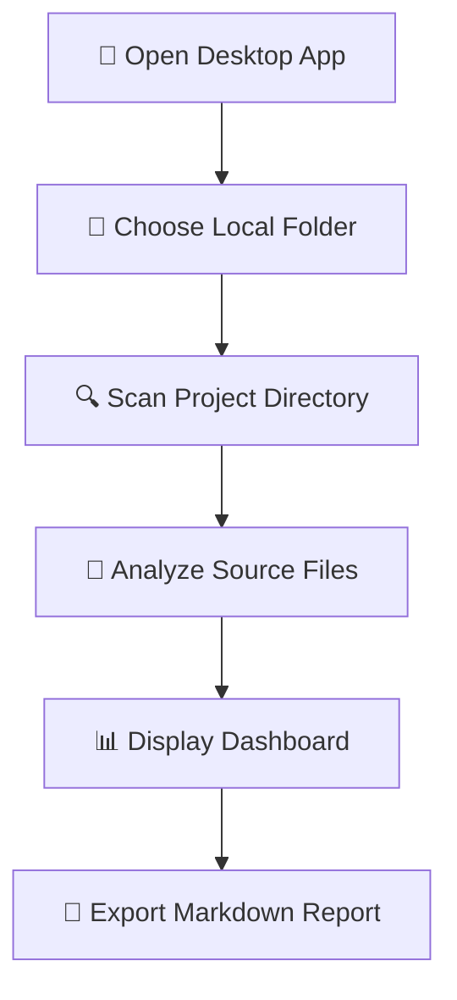
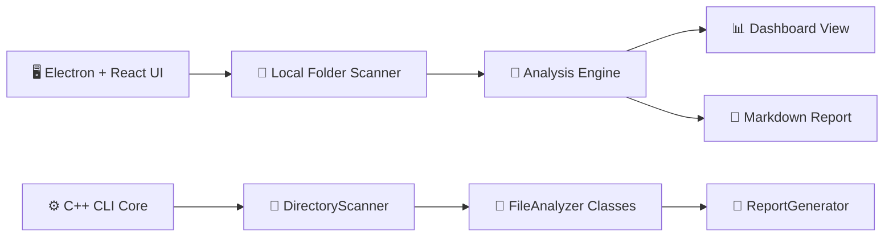
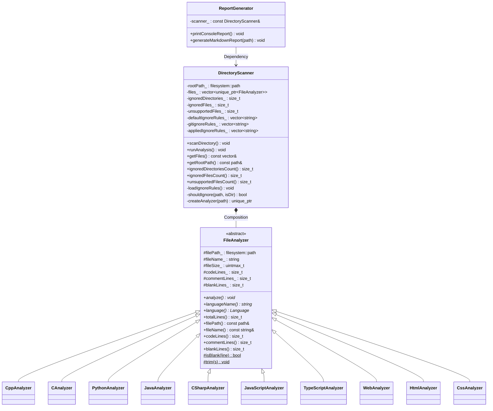

# 🧱 Architecture & OOP Design Patterns

This document details the software architecture, class design, and Object-Oriented Programming (OOP) principles implemented within the **Codebase Analyzer** project.

---

## 🎨 System Flow

The system features two main traversal paths: the local Electron + React frontend desktop flow, and the backend high-performance C++ CLI Core scanner.

### 🖥️ Desktop UI Flow

### 🧱 Component Interactions

---

## 📊 Class Structure Diagram

The C++ Core Engine is built entirely using OOP principles with clean abstraction, strong type-safety, and modular composition:

---

## 🧩 Core OOP Principles Applied

| OOP Principle | Implementation Detail in Codebase |
|:---|:---|
| 🧊 **Abstraction** | The abstract base class `FileAnalyzer` defines a rigid interface for analyzing files (`analyze()`, `languageName()`, metrics accessors) without dictating concrete implementation details. |
| 🧬 **Inheritance** | Platform/Language-specific classes (e.g. `CppAnalyzer`, `PythonAnalyzer`, `JavaAnalyzer`) derive from `FileAnalyzer`, reusing properties and defining syntax-specific parser logic. |
| 🔁 **Polymorphism** | Dynamic binding is achieved by storing pointers to derived objects in a `std::vector<std::unique_ptr<FileAnalyzer>>`. The scanner fires `file->analyze()` polymorphically. |
| 🔒 **Encapsulation** | Each class guards its private members. For example, `DirectoryScanner` keeps ignore rules and file lists private, exposing them only via secure read-only accessors (`getFiles()`). |
| 🧱 **Composition** | `DirectoryScanner` exhibits **composition** by managing the complete lifecycle of `FileAnalyzer` objects via `std::unique_ptr` smart containers. |
| 🛠️ **Dependency Injection** | `ReportGenerator` utilizes dependency injection via reference (`const DirectoryScanner&`) to generate reports from scanner results, decoupling scanning and reporting concerns. |
